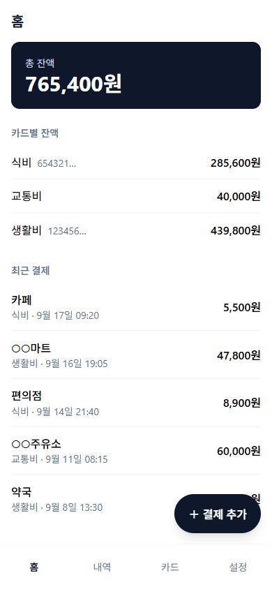
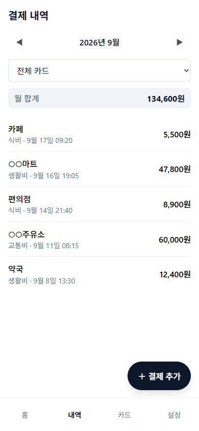
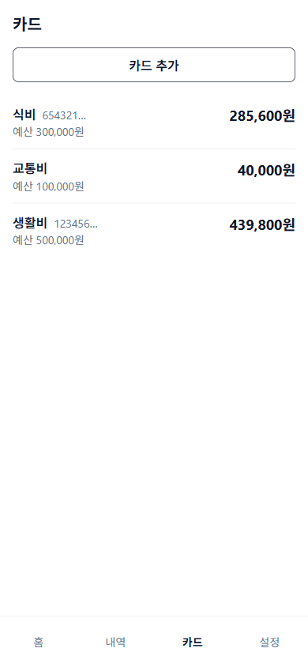
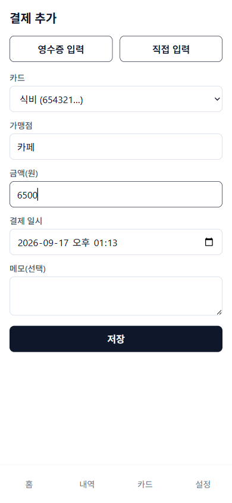

# SW2HW 장부

공용 PIN 6자리 하나로 여러 사람이 함께 쓰는 모바일 우선 PWA 장부입니다. 카드를 등록해 예산을 두고, 영수증을 촬영(네이버 CLOVA General OCR + 필요할 때만 Gemini 보완)하거나 직접 입력해 결제를 기록하면 해당 카드의 잔액이 줄어듭니다. 언제 접속하든 총 잔액, 카드별 잔액, 결제 내역을 볼 수 있습니다. 백엔드는 Supabase(Postgres, Auth, Edge Function), 프런트는 GitHub Pages에 올린 정적 SPA이며 nginx Docker 이미지로도 띄울 수 있습니다.

| 홈 | 결제 내역 | 카드 | 결제 추가 |
|---|---|---|---|
|  |  |  |  |

예시 데이터로 찍은 화면입니다.

- 배포 주소: https://dwiw2d.github.io/team_budget_manager/
- 설계 스펙: `docs/superpowers/specs/2026-09-16-sw2hw-ledger-design.md` (구현 계약서)
- 용어 사전: `CONTEXT.md` / 백엔드 선택 배경: `docs/adr/0001-supabase-cloud-with-self-host-path.md`

## 기능 요약

- PIN 6자리만 입력해 로그인하며(6자리를 채우면 자동으로 로그인을 시도합니다), 틀리면 오류 메시지를 보여 주고 세션은 브라우저에 유지됩니다. 로그인하지 않으면 어떤 경로로 들어와도 로그인 화면으로 보냅니다.
- 카드를 이름·예산·카드번호 앞 6~8자리(선택)로 추가·수정·삭제합니다. 결제가 있는 카드는 삭제할 수 없다고 안내합니다.
- 홈에서 총 잔액(카드 잔액의 합), 카드별 잔액, 최근 결제 5건을 봅니다.
- 결제를 직접 입력하면 해당 카드 잔액이 즉시 줄어듭니다.
- 카드 잔액은 매월 1일 0시(한국 시간)에 그 카드의 예산으로 저절로 다시 채워집니다. 누를 버튼은 없습니다.
- 예산은 한 달 치 한도입니다. 값을 고쳐도 이번 달 잔액은 그대로이고 다음 달 1일부터 적용됩니다.
- 지난달 날짜의 영수증을 늦게 넣으면 내역에만 들어가고 이번 달 잔액은 줄지 않습니다.
- 영수증을 촬영하면 OCR로 가맹점·금액·일시·카드번호를 읽어 폼을 채우고, 앞자리가 일치하는 카드가 하나면 자동 선택합니다(영수증은 뒤 4자리를 가립니다). 앞자리가 같은 카드가 두 장 이상이면 자동 선택하지 않고 직접 고르라고 알립니다. 확신하지 못한 칸은 호박색 테두리와 "확인해 주세요" 로 표시합니다. OCR에 실패하면 안내 후 직접 입력할 수 있습니다.
- OCR 무료 한도는 CLOVA General OCR 월 100건, Gemini 하루 20건(한국 시간 기준)이며 `ocr_limits` 표의 `limit_count` 를 고쳐 바꿉니다(예: `update public.ocr_limits set limit_count = 200 where provider = 'clova';`). Gemini 의 20건은 구글이 공식으로 밝힌 숫자가 아니라 제3자 비공식 실측값에 맞춘 자체 상한입니다(`docs/ocr/gemini.md` §3). 둘 다 소진되면 "영수증 입력" 버튼이 회색으로 바뀌고 누르면 말풍선으로 안내하며, 직접 입력은 그대로 쓸 수 있습니다.
- 영수증으로 넣은 결제는 사진도 함께 보관합니다. 긴 변 1200px·JPEG 품질 0.7 로 줄여(장당 약 200KB) Supabase 파일 저장소의 비공개 버킷 `receipts` 에 `{owner_id}/{payment_id}.jpg` 경로로 올리고, 결제 상세 시트를 열 때만 5분짜리 서명 URL 로 받아 보여 줍니다(누르면 전체 화면). 결제가 지워지면(세 달 지난 결제 정리 포함) 데이터베이스 트리거가 그 사진 파일도 함께 지웁니다 — 앱을 열지 않아도 정리됩니다. 다만 이 요청은 비동기(`pg_net`)라 실패해도 다시 시도하지 않습니다. 직접 입력한 결제에는 사진이 없습니다.
- 무료 한도는 파일 저장소 1GB, 월 전송량 5GB 입니다(사진 장당 약 200KB 기준 약 5,000장). DB 는 500MB 로 결제 기록에만 씁니다.
- 내역은 월 이동, 카드 필터, 월 합계(취소 제외)를 제공하고 최신순으로 정렬합니다.
- 결제 상세에서는 메모만 수정할 수 있고 다른 필드는 바꿀 수 없습니다. 결제는 삭제할 수 없고 취소만 가능하며, 취소는 확인창을 거치고 되돌릴 수 없습니다. 취소된 결제는 잔액에서 빠지고 취소선으로 표시됩니다.
- 설정에서 현재 PIN 을 확인한 뒤 PIN 을 바꾸면 새 PIN 으로만 로그인됩니다.
- PWA로 설치할 수 있고, 오프라인이면 안내 배너를 보여 줍니다.
- 데이터 보호는 RLS와 트리거가 맡습니다. 익명 접근은 0건, 로그인 후에도 결제 삭제·금액 수정은 거부됩니다. 공개 회원가입은 막혀 있습니다.

## 로컬 개발

```sh
npm install
npm run dev
```

`.env.local`(git 무시)에 아래 키를 둡니다. 값은 어디에도 출력하지 않습니다.

| 키 | 용도 |
|---|---|
| `SUPABASE_ACCESS_TOKEN` | Supabase CLI·Management API 개인 토큰 |
| `SUPABASE_PROJECT_REF` | 클라우드 프로젝트 ref |
| `SUPABASE_DB_PASSWORD` | DB 비밀번호(`sb:link`, `sb:push`) |
| `VITE_SUPABASE_URL` | 브라우저가 붙는 Supabase URL |
| `VITE_SUPABASE_ANON_KEY` | 브라우저용 anon 키 |
| `APP_OWNER_EMAIL` | 유일한 계정 이메일(`owner@sw2hw.local`) |
| `APP_OWNER_PASSWORD` | 그 계정의 초기 PIN 6자리 |
| `NAVER_OCR_GENERAL_INVOKE_URL` | 네이버 CLOVA General OCR Invoke URL(이미 `/general` 로 끝납니다) |
| `NAVER_OCR_GENERAL_SECRET` | 네이버 CLOVA General OCR 시크릿 |
| `GEMINI_API_KEY` | Gemini API 키(선택. 없으면 CLOVA 결과만 씁니다) |
| `GEMINI_MODEL` | Gemini 모델 이름(선택. 기본 `gemini-3.6-flash`) |

빌드 시 선택 변수: `VITE_BASE_PATH`(기본 `/`, GitHub Pages는 `/team_budget_manager/`).

## 테스트·빌드

```sh
npm test              # Vitest 단위 테스트
npm run typecheck     # tsc --noEmit
npm run build         # dist/ 생성
```

Docker 이미지 빌드와 실행(8080 포트):

```sh
docker compose --env-file .env.local up -d --build   # 또는 .env 파일에 VITE_* 값을 두고 docker compose up -d --build
curl -s -o /dev/null -w '%{http_code}\n' http://localhost:8080/payments   # 200 이면 SPA fallback 정상
docker compose down
```

## 클라우드 배포 순서

1. `npm run sb:link` — 클라우드 프로젝트 연결
2. `npm run sb:push` — `supabase/migrations` 적용(`0001`~`0008`)
3. `npm run sb:functions` — Edge Function `ocr` 배포
4. `npm run sb:secrets` — `.env.local` 의 네이버·Gemini 키를 Edge Function 시크릿으로 올림(있는 값만 올리고 이름만 출력합니다)
5. `npm run sb:disable-signup` — 공개 가입 차단
6. `npm run sb:seed-owner` — 계정 1개 생성(첫 로그인 뒤 설정 화면에서 PIN 을 바꾸는 것을 권합니다)
7. `npm run sb:db-secrets` — 사진 삭제 트리거가 쓸 값을 Vault 에 저장(`app_project_url`, `app_service_role_key`)
8. `npm run db:smoke` — DB 규칙 스모크 검증
9. `git push origin HEAD:main` — GitHub Actions가 테스트·타입체크·빌드 후 GitHub Pages에 배포

GitHub 저장소 설정(이미 되어 있음): Pages 소스는 GitHub Actions, 저장소 variables에 `VITE_SUPABASE_URL`, `VITE_SUPABASE_ANON_KEY` 등록(`gh variable set`). 하위 경로 새로고침은 `dist/404.html`(index.html 복사본)로 처리하므로 HTTP 상태는 404이지만 앱은 정상 로드됩니다.

## 자체 호스팅 Supabase로 옮기기

공식 Docker Compose 안내: https://supabase.com/docs/guides/self-hosting/docker

1. Supabase 실행: 공식 저장소의 `docker` 폴더를 복사하고 `.env.example`을 `.env`로 복사해 비밀 값(`POSTGRES_PASSWORD`, `JWT_SECRET`, `ANON_KEY`, `SERVICE_ROLE_KEY`, `DASHBOARD_PASSWORD` 등)을 새로 채운 뒤 `docker compose up -d`.
2. 공개 가입 차단: `.env`에서 `DISABLE_SIGNUP=true`(compose가 `GOTRUE_DISABLE_SIGNUP`으로 전달). `ENABLE_EMAIL_SIGNUP=true`는 이메일 로그인 자체를 켜는 값이므로 그대로 둔다.
3. 마이그레이션 적용(Supavisor 세션 포트 5432, 사용자는 `postgres.<POOLER_TENANT_ID>`):
   ```sh
   npx supabase db push --db-url "postgresql://postgres.<tenant>:<POSTGRES_PASSWORD>@<host>:5432/postgres"
   ```
4. 함수 배포: `supabase/functions/ocr`를 `docker/volumes/functions/ocr`로 복사하고, compose의 `functions` 서비스 환경에 `NAVER_OCR_GENERAL_INVOKE_URL`, `NAVER_OCR_GENERAL_SECRET`(+ 선택 `GEMINI_API_KEY`, `GEMINI_MODEL`)을 추가한 뒤 `docker compose restart functions`. 함수 URL은 `http://<host>:8000/functions/v1/ocr`.
5. 계정 생성: `scripts/seed-owner.mjs`는 service_role 키를 클라우드 CLI(`supabase projects api-keys`)로 얻으므로 자체 호스팅에서는 같은 호출을 `docker/.env`의 `SERVICE_ROLE_KEY`로 직접 보낸다.
   ```sh
   curl -X POST "http://<host>:8000/auth/v1/admin/users" \
     -H "apikey: $SERVICE_ROLE_KEY" -H "Authorization: Bearer $SERVICE_ROLE_KEY" \
     -H "Content-Type: application/json" \
     -d '{"email":"owner@sw2hw.local","password":"<초기 PIN 6자리>","email_confirm":true}'
   ```
6. 프런트 실행: `.env`에 `VITE_SUPABASE_URL=http://<host>:8000`, `VITE_SUPABASE_ANON_KEY=<ANON_KEY>`를 두고 `docker compose up -d --build` → `http://<host>:8080`.

## 주의

- Supabase 무료 프로젝트는 7일간 요청이 없으면 일시정지됩니다. 대시보드에서 다시 켜거나, 자체 호스팅으로 옮기면 사라지는 문제입니다.
- 서버 스키마·함수는 `supabase/migrations`, `supabase/functions`가 유일한 원본입니다. 대시보드에서 손으로 바꾸지 않습니다.
